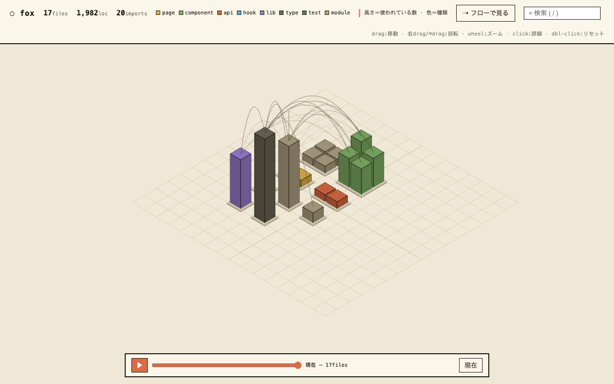

# system-map

コードベースをアイソメ3D都市として可視化する単体HTMLジェネレータ。ゼロ依存Node（生成に three を使うが、**出力は1ファイルで完結**——ビルド済みHTMLはどこでも開ける）。



## 使い方

```bash
npm i
node src/extract.mjs <repo-root> city.json        # コードベース解析 → 都市データ
node src/render3d.mjs city.json dist/city.html    # 3Dアイソメ都市の単体HTML生成
node src/serve.mjs . 7788                         # ライブプレビュー（編集→リロード）
```

## 機能

- **都市 = コードベース**: ディレクトリ=区画、ファイル=建物（高さ=fan-in×LOC）、色=種別（page/component/api/lib/type…）
- **タイムライン**: `timeline-<name>.json` があると再生バーが出る。コミット時系列で街が育つ（新築=リング、建設予定地=ストライプ、ワイヤは高さに追従）
- **検索・選択**: `/` で検索ジャンプ。クリックで詳細パネル＋関連ワイヤ強調
- **操作**: ドラッグ=パン / 右ドラッグ・⌘Ctrl+ドラッグ=回転 / ホイール・ピンチ=カーソルアンカーズーム

## 関連

- [cosmtrek/mindwalk](https://github.com/cosmtrek/mindwalk) — エージェント作業再生の発想元
- 発端: X の ashish-nagmoti/codebase-isometric-visualizer
